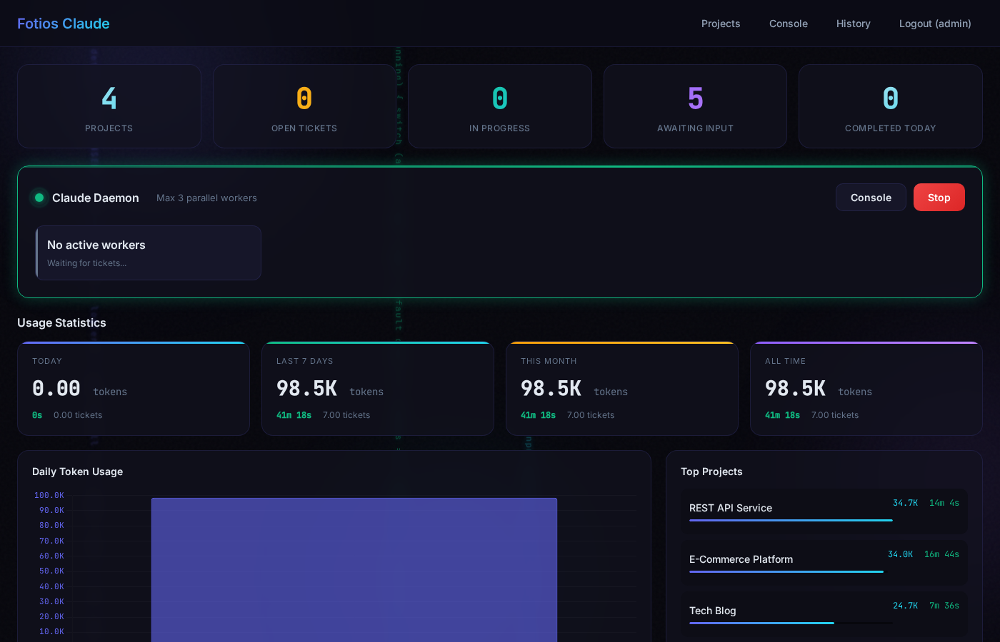
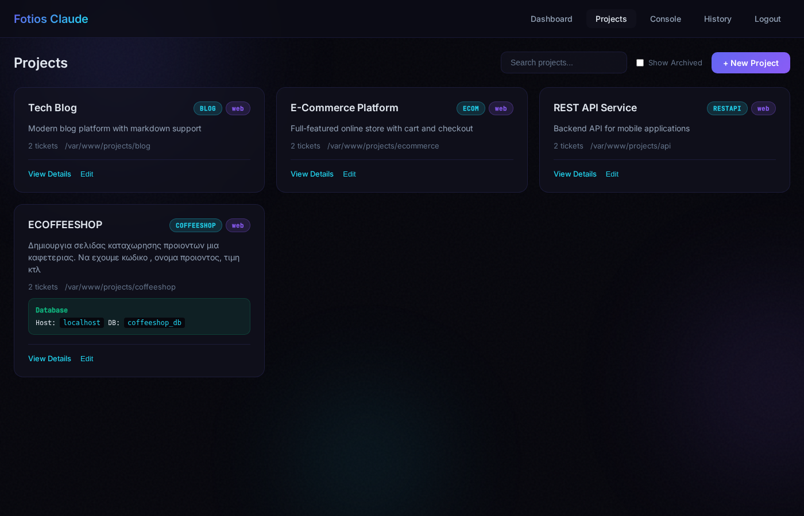
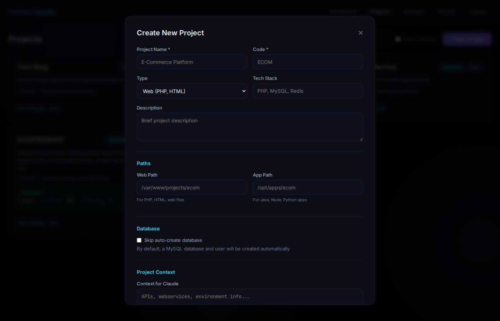
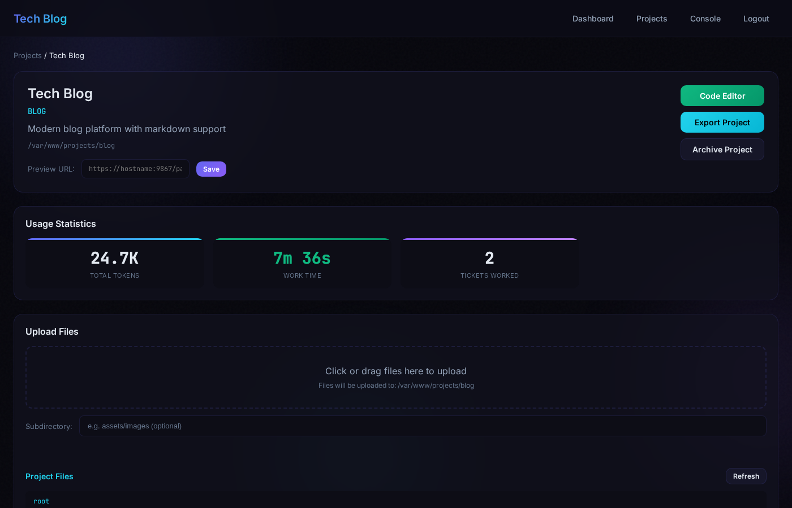
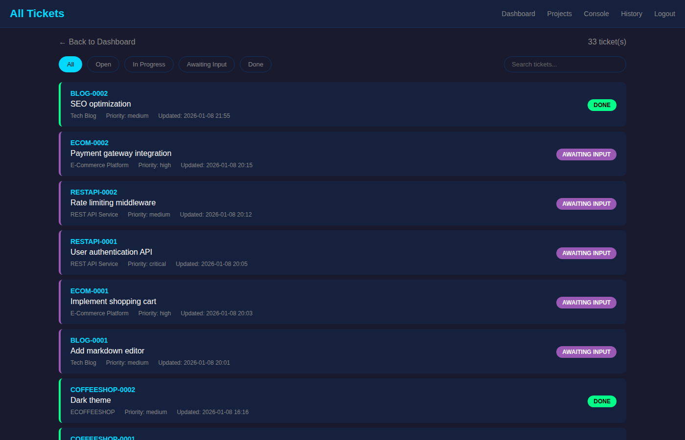
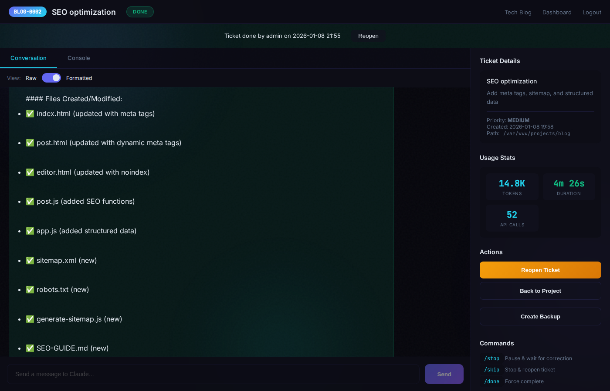
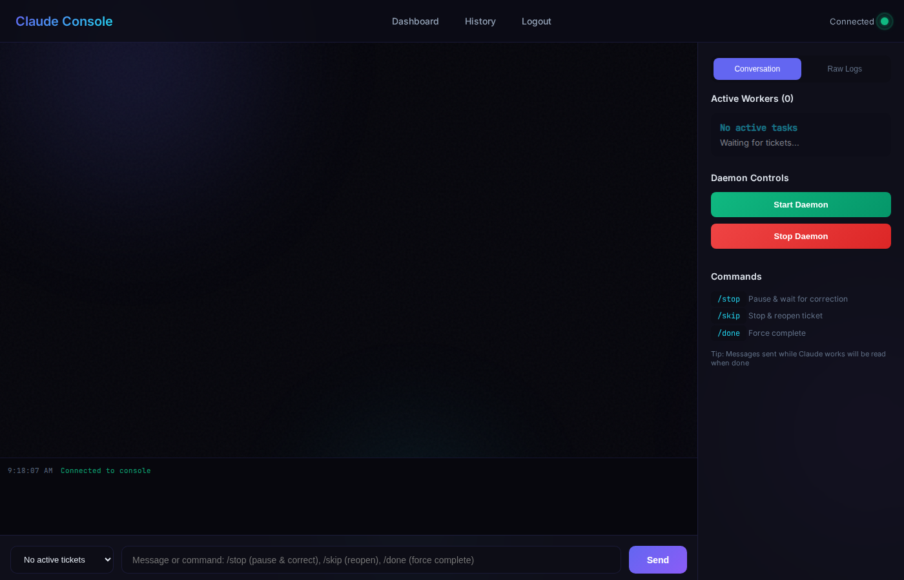
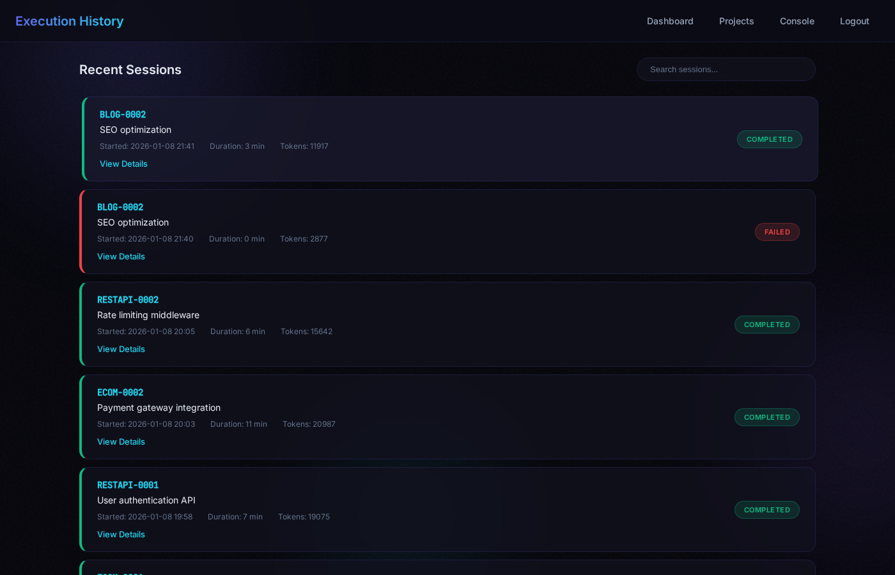

# Claude-AI-developer User Guide

This guide will walk you through using the Claude-AI-developer Admin Panel to manage your AI-powered development projects.

## Table of Contents

1. [Dashboard](#dashboard)
2. [Managing Projects](#managing-projects)
3. [Working with Tickets](#working-with-tickets)
4. [Console View](#console-view)
5. [Execution History](#execution-history)
6. [Kill Switch Commands](#kill-switch-commands)

---

## Dashboard

The Dashboard is your main control center. It shows:

- **System Status**: Whether Claude daemon is running
- **Quick Stats**: Active projects, open tickets, sessions today
- **Recent Activity**: Latest ticket updates and completions



---

## Managing Projects

### Viewing Projects

The Projects page shows all your development projects. Each project card displays:

- Project name and description
- Working directory path
- Number of open tickets
- Quick action buttons



### Creating a New Project

Click **"New Project"** to create a project:

1. **Name**: A descriptive name for your project
2. **Working Directory**: The full path where Claude will work (e.g., `/home/claude/my-app`)
3. **Description**: Brief description of what the project is about



### Project Details

Click on any project to see its details and all associated tickets.



---

## Working with Tickets

Tickets are the core of Claude-AI-developer. Each ticket represents a task for Claude to complete.

### Viewing Tickets

The Tickets page shows all tickets across all projects with filtering options.



### Creating a Ticket

1. Go to a Project or click **"New Ticket"**
2. Select the target project
3. Enter your task description in the **Prompt** field
4. Set priority (optional)
5. Click **Submit**

### Ticket Lifecycle

Tickets flow through these statuses:

| Status | Description |
|--------|-------------|
| `open` | Waiting to be processed |
| `in_progress` | Claude is currently working on it |
| `awaiting_input` | Claude needs your response |
| `done` | Successfully completed |
| `failed` | Something went wrong |
| `cancelled` | Manually cancelled |

### Ticket Detail View

The ticket detail page shows:

- Full prompt and any responses
- Real-time execution output
- Status history
- Action buttons (Reopen, Cancel, etc.)



---

## Console View

The Console provides a real-time view of Claude's execution output.

- **Live streaming**: See Claude's work as it happens
- **Scrollable history**: Review past output
- **Auto-scroll**: Stays at bottom for new content



---

## Execution History

The History page shows all past execution sessions:

- Start and end times
- Duration
- Exit codes
- Associated tickets



---

## Kill Switch Commands

When Claude is working on a ticket, you can control execution using kill switch commands. Enter these in the ticket's response field:

| Command | Description |
|---------|-------------|
| `/stop` | Stop execution immediately and mark as failed |
| `/skip` | Skip current ticket, move to next |
| `/done` | Mark as completed successfully |
| `/cancel` | Cancel the ticket entirely |

### How to Use Kill Switch

1. Open the ticket that's currently `in_progress`
2. Type your command (e.g., `/stop`) in the response field
3. Click **Submit**
4. Claude will detect the command and act accordingly

---

## Tips & Best Practices

### Writing Good Prompts

- Be specific about what you want
- Include file paths when relevant
- Mention the programming language/framework
- Specify any constraints or requirements

**Good Example:**
```
Create a REST API endpoint in /home/claude/my-app/api/users.py
that handles GET /users/{id} and returns user data from the
MySQL database. Use the existing db_connection module.
```

**Bad Example:**
```
Make a user API
```

### Project Organization

- One project per codebase
- Use descriptive project names
- Keep working directories organized

### Monitoring Execution

- Check the Console for real-time progress
- Review ticket output after completion
- Use History to track patterns and issues

---

## Troubleshooting

### Ticket Stuck in "in_progress"

If a ticket seems stuck:
1. Check Console for errors
2. Use `/stop` kill switch if needed
3. Reopen the ticket to retry

### Claude Not Processing Tickets

1. Check if daemon is running: `systemctl status fotios-claude-daemon`
2. Review daemon logs: `journalctl -u fotios-claude-daemon -f`
3. Verify MySQL is running: `systemctl status mysql`

### Permission Errors

Ensure the `claude` user has:
- Read/write access to project directories
- Proper ownership of working files

---

## Need Help?

- **Documentation**: Check `CLAUDE_OPERATIONS.md` for technical details
- **Issues**: Report bugs at [GitHub Issues](https://github.com/fotsakir/Claude-AI-developer/issues)
- **Updates**: Check [Releases](https://github.com/fotsakir/Claude-AI-developer/releases) for new versions

---

*Claude-AI-developer v2.26.14 - Smartnav*
